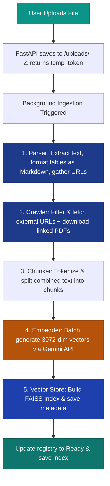
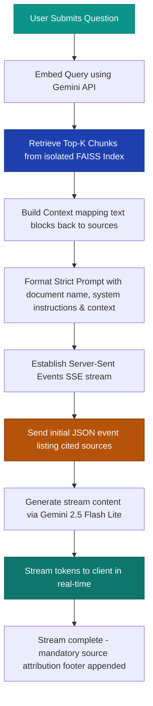

# Ragnify — Technical & Architectural Project Context

Ragnify is a premium, enterprise-grade **Document Intelligence & Retrieval-Augmented Generation (RAG)** platform. It is engineered for professionals across government, legal, enterprise, and all industries who require high-precision, zero-hallucination analysis of complex documents.

This context file provides a comprehensive overview of Ragnify's architecture, pipelines, data flows, and code patterns to enable developers and AI systems to immediately understand, maintain, and extend the project.

---

## 1. System Overview & Value Proposition

Traditional RAG systems often suffer from three critical failures in enterprise settings:
1. **Loss of Tabular Context:** PDFs or Word documents contain tables that are flattened into regular text, destroying column-row associations.
2. **Information Silos:** Documents reference external URLs or hyperlinked appendices, which are ignored, leaving the RAG context incomplete.
3. **Hallucinations:** Standard LLMs will extrapolate or use pre-trained knowledge when a document lacks specific facts, posing a severe compliance risk.

**Ragnify solves these failures through a specialized architecture:**
* **Tabular Document Parsing:** Extracted tables (via PyMuPDF and python-docx) are preserved and formatted as semantic Markdown tables before indexing.
* **Autonomous Hyperlink Crawling:** Ingested documents are scanned for external links. A concurrent HTTP crawling pipeline fetches, cleans, and indexes their content alongside the primary document — including **linked PDFs** which are downloaded and parsed automatically.
* **Gemini-Powered Groundedness:** Uses `gemini-embedding-001` for high-fidelity 3072-dimensional vector search and `gemini-2.5-flash-lite` with a zero-hallucination system prompt to guarantee that answers are strictly factual and fully cited.
* **Per-Document FAISS Indexing:** Instead of a single shared database, each document gets its own isolated FAISS index folder, allowing instant deletion, update, and high-performance querying without database cross-contamination.
* **Mandatory Source Attribution:** Every answer ends with a `📎 Sources Used` section citing both the document page and any crawled hyperlink URLs, along with the originating PDF filename.

---

## 2. Directory & Component Architecture

Below is the repository structure showing the modular separation of the backend RAG pipeline and frontend UI.

```
d:\BankRAG
└── BankRAG
    ├── backend/
    │   ├── main.py            # FastAPI Application entry-point, CORS, static mounts, and API routes.
    │   ├── config.py          # Unified settings (API keys, models, chunk parameters, prompt templates).
    │   ├── parser.py          # Document parsing (PDF, DOCX, Images/OCR via Tesseract, PPTX).
    │   ├── crawler.py         # Enhanced crawler: fetches hyperlinks, downloads linked PDFs, retry logic.
    │   ├── chunker.py         # Token-aware text chunking with cl100k_base (tiktoken).
    │   ├── embedder.py        # Google Gemini embedder featuring batching, rate-limiting, and local caching.
    │   ├── vector_store.py    # Local FAISS index builder and vector search (FlatIP / IVFFlat).
    │   ├── rag_engine.py      # Main pipeline coordinator for ingestion and stream generation.
    │   ├── requirements.txt   # Backend dependency specifications.
    │   ├── test_upload.py     # Ingestion pipeline testing script.
    │   └── test_chat.py       # Streaming chat endpoint testing script.
    │
    ├── frontend/
    │   ├── index.html         # Premium dark-mode glassmorphic shell with sidebar and modals.
    │   ├── app.js             # Client-side state manager, SSE streaming parser, and polling loops.
    │   └── style.css          # Elite bespoke dark-mode design system with variables and animations.
    │
    ├── data/
    │   └── indexes/
    │       ├── .registry.json            # Global registry tracking ingested doc metadata.
    │       ├── .embedding_cache.json     # Local cache (sha256 of text -> vectors) avoiding duplicate embedding fees.
    │       └── [doc_id]/                 # Dedicated index directory for each uploaded document.
    │           ├── index.faiss           # Compiled binary FAISS vector file.
    │           └── metadata.json         # Parallel JSON mapping FAISS vectors back to chunk texts & sources.
    │
    ├── uploads/                          # Temporary storage of uploaded original document files.
    └── project_context.md               # This file — full architectural context for developers and AI.
```

---

## 3. Ingestion & Query Pipelines

The system executes two primary data pipelines: **Document Ingestion** and **Query & Retrieval**.

### A. Document Ingestion Flow (Background Worker)
When a user uploads a document, FastAPI saves the file, registers a pending state, and runs this asynchronous pipeline in the background:



### B. Query & Retrieval Flow (Streaming SSE)
When a user asks a question, Ragnify retrieves relevant segments and streams a strictly-grounded answer:



---

## 4. In-Depth Component Analysis

### A. Configuration (`config.py`)
Centralizes keys, models, parameters, and prompts:
* **Gemini API Key:** Handled with a robust loading sequence: Environment Variable `GEMINI_API_KEY` → `.env` file loading → Fallback key.
* **Models:**
  * `EMBEDDING_MODEL = "gemini-embedding-001"` produces 3072-dimensional embeddings.
  * `CHAT_MODEL = "gemini-2.5-flash-lite"` provides rapid, cost-effective inference compatible with free tiers.
* **RAG Tuning:**
  * `CHUNK_SIZE = 1000` tokens and `CHUNK_OVERLAP = 200` ensure tables and tender specifications are kept intact.
  * `TOP_K = 25` takes advantage of Gemini's large context window, ensuring the model reviews maximum retrieved contexts.
  * `MAX_TOKENS_ANSWER = 4096` allows for detailed answers with full source citations.
* **Crawler Tuning:**
  * `MAX_CRAWL_URLS = 50` (increased from 30) for documents with many hyperlinks.
  * `CRAWL_TIMEOUT = 15` seconds (increased from 10) for slow government/banking sites.
  * `MAX_CRAWL_WORKERS = 10` concurrent connections for faster crawling.
* **System Prompt:** Features strict directives instructing Ragnify to answer **only** using provided context, return an explicit error string if no match is found, cite references like `[Page X]` or `[Source: URL]`, and **always end with a `📎 Sources Used` section** listing all sources with the originating document name.

### B. Parser (`parser.py`)
Supports `.pdf`, `.docx`, `.doc`, image OCR (`.jpg`, `.png`, `.bmp`, `.tiff`), and `.pptx`:
* **Table Extraction:**
  * In PDFs, uses `fitz` (PyMuPDF `find_tables()`) to extract tabular boundaries, formatting rows into explicit clean Markdown matrices (`| col1 | col2 |`).
  * In Word docs, iterates through `doc.tables` structure to generate Markdown equivalents.
* **Metadata Citing:** Pages are indexed with distinct headers (e.g. `Page 1`, `Table 1 on Page 3`), preserving the reference coordinates.
* **URL Extraction:** Enhanced regex captures URLs with encoded characters, query parameters, and fragments. Trailing punctuation is cleaned. URLs are extracted from both PDF annotations and visible text.
* **OCR Fallback:** Uses `pytesseract` to scan scans and screenshots, locating the executable binary in default Windows paths.
* **Document Classifier:** Runs a regex keyword scan (`_detect_doc_type`) to categorize document domain (e.g., `tender`, `policy`, `loan`, `account`, `kyc`, `report`, `general`).

### C. Web Crawler (`crawler.py`) — **Enhanced**
A powerful autonomous scraper that reads links in the background:
* **Reduced Domain Blocking:** Only blocks truly useless domains (YouTube, Facebook, TikTok, CDN hosts). LinkedIn, GitHub, Google Docs are now crawled successfully.
* **Concurrent Scraping:** Implements an asynchronous worker using `httpx.AsyncClient` with a pool of up to 10 concurrent connections.
* **Clean Text Extraction:** Uses `BeautifulSoup` to strip noise elements, extracts primary content containers, preserves short lines (≥10 chars) for bullet points and data items, prepends page titles for context, and caps output at **15,000 characters per URL**.
* **Linked PDF Support:** If a URL returns `application/pdf`, the crawler downloads the PDF (up to 5MB), extracts text using PyMuPDF, and indexes it — up to 10 linked PDFs per document.
* **Retry Logic:** Failed URLs are retried once with exponential backoff. Rate-limited (429) and unavailable (503) responses trigger automatic retries.
* **JSON/XML Support:** API responses in JSON or XML format are parsed and indexed as readable text.
* **Thread-safe Execution:** Wraps async fetching in a synchronous executor (`ThreadPoolExecutor`) when called from the synchronous background context.

### D. Chunker (`chunker.py`)
Uses the `tiktoken` library encoding `cl100k_base` to tokenize text.
* Splits text sequentially. Instead of arbitrary character counts, it measures real LLM token constraints, creating perfectly aligned context blocks.
* Appends metadata keys (`chunk_id`, `doc_id`, `source`, `chunk_index`) to every segment, letting the retrieval engine pinpoint the exact paragraph or table.

### E. Embedder (`embedder.py`)
Generates vector arrays with premium cost-avoidance logic:
* **Local Caching:** Maintains a local registry `.embedding_cache.json`. When indexing, it computes the SHA-256 hash of each text chunk. If a chunk hash exists in the cache, it bypasses the API call, cutting costs and accelerating ingestion.
* **Exponential Backoff:** If the Gemini API returns a `429` (Rate Limit Exceeded) or `RESOURCE_EXHAUSTED` error, the embedder automatically catches the exception and waits with progressive delays (`2 ** attempt * 3` seconds).
* **L2 Normalization:** Embeddings are division-normalized by their vector lengths. This allows the FAISS vector index to perform fast Cosine Similarity searches using standard Inner Product matrix multiplications.

### F. Vector Store (`vector_store.py`)
Constructs and queries the vector indexes:
* **Hybrid FAISS Indexing:**
  * If a document has fewer than 5,000 chunks, it creates a Flat Inner Product index (`faiss.IndexFlatIP`) for exact, high-speed cosine match lookup.
  * If a document has more than 5,000 chunks (e.g. multi-volume corporate records), it trains a fast inverted file index (`faiss.IndexIVFFlat`) to ensure response times remain sub-second.
* **Isolated Folders:** Index binaries (`index.faiss`) and parallel chunk records (`metadata.json`) are stored inside a unique `[doc_id]` directory, providing isolated file-system modularity.

### G. Ingestion Coordinator (`rag_engine.py`) — **Enhanced**
Provides the core RAG runtime binding the parser, crawler, chunker, embedder, and vector store together:
* **Source Attribution:** Crawled content is labeled with both the URL and the originating document filename (e.g., `Source: https://example.com (linked from "document.pdf")`), enabling precise citation in answers.
* **Document Name in Prompt:** The LLM prompt now includes `DOCUMENT NAME: "filename.pdf"` so the model can reference the originating file in its source attribution.
* **Global registry:** Maintains `.registry.json` tracking documents, statuses (`parsing`, `crawling`, `embedding`, `indexing`, `ready`, `error`), segment metrics, and URL counts.
* **SSE Stream Generator:** Combines the user query with the retrieved top-k chunks into a structured prompt, spawns a background thread executor using `genai.Client().models.generate_content_stream()`, and channels generated tokens into a thread-safe queue. FastAPI reads this queue and yields formatted Server-Sent Events to the client.

### H. Backend API (`main.py`)
A FastAPI server exposing robust endpoints:
* **`POST /upload`**: Validates file types, generates a unique 8-character ID, registers a temporary token, and registers a background worker using `BackgroundTasks.add_task` to run the ingestion pipeline.
* **`POST /chat`**: Takes `doc_id` and `question`, verifies readiness, and returns a `StreamingResponse` executing `answer_question_stream`.
* **`GET /documents`**: Returns metadata, chunk metrics, and status messages for all indexed files.
* **`POST /settings`**: Allows updating the Gemini API key at runtime. Persists keys to the local `.env` file automatically.
* **`DELETE /documents/{doc_id}`**: Wipes index folders and uploaded files instantly.

---

## 5. Frontend & Design Language (`frontend/`)

Ragnify's UI is designed with a premium, state-of-the-art interface:
* **Elite Color Palette:** Utilizes cohesive Slate dark neutrals (`#020617`, `#0f172a`), deep blues (`#1a56db`), and gold accents (`#fbbf24`).
* **Glassmorphism Aesthetics:** Applies heavy backdrops (`backdrop-filter: blur(20px)`) and subtle semi-transparent borders (`rgba(255,255,255,0.06)`).
* **Mesh Gradient Background:** Employs animated vector orbs floating dynamically across the screen using smooth, optimized CSS keyframes (`@keyframes orb-float`).
* **Real-time Pipeline Tracker:** The UI displays a multi-step timeline modal that updates live while a document is ingested, letting the user track parsing, crawling, embedding, and indexing progress.
* **Seamless SSE Stream Parser:** Parses the Event Stream in `app.js`, handles chunk citations, lists verified sources, and features markdown auto-scrolling with micro-animations.
* **Source Badges:** After each answer, clickable source badges display the page number or URL, making it easy to trace where information came from.

---

## 6. Setup & Developer Quickstart

To run Ragnify locally on your machine, complete the following steps:

### 1. Prerequisites
Ensure you have **Python 3.10+** and **Tesseract OCR** (for image text scanning) installed.

### 2. Install Dependencies
Run the following command inside the backend folder to install the required libraries:
```bash
pip install -r BankRAG/backend/requirements.txt
```

### 3. Provide Gemini API Key
Create a `.env` file inside the `BankRAG` folder or configure your terminal environment:
```env
GEMINI_API_KEY="AIzaSy..."
```

### 4. Run the Server
Launch the backend server using `uvicorn`:
```bash
python BankRAG/backend/main.py
```
The server will start on **`http://localhost:8000`**. You can access the UI by opening this address in your browser.

### 5. Run Verification Tests
* Test document upload and indexing: `python BankRAG/backend/test_upload.py`
* Test streaming Q&A retrieval: `python BankRAG/backend/test_chat.py`

---

## 7. Key Architecture & AI Guidelines

When interacting with this codebase as an AI assistant, observe these patterns:
1. **Maintain Groundedness:** Do not adjust prompt constraints in `config.py` without preserving the anti-hallucination guardrails.
2. **Batch Embedding Caching:** Ensure any edits to `embedder.py` preserve the text-hashing structure; otherwise, the system will re-embed previously indexed content, increasing API costs.
3. **CORS & Static Files:** The API serves static pages from `frontend/` under `/static`. Ensure modifications to backend paths do not break file-routing paths.
4. **FAISS Modularity:** Keep index management encapsulated within `vector_store.py` so that alternate vector databases (e.g. Qdrant, Chroma) can be easily integrated in the future.
5. **Source Attribution:** All crawled content must include the originating document filename in source labels. The system prompt mandates a `📎 Sources Used` footer in every answer.

---

## 8. Changelog

### v2.0.0 — Ragnify (May 2025)
- **Rebranded** to **Ragnify** across all files
- **Crawler Enhancement:** Reduced blocked domains (LinkedIn, GitHub now crawled), increased text limit from 8K→15K chars per URL, added linked PDF download/extraction, retry logic with backoff, JSON/XML parsing
- **Source Attribution:** Crawled content labeled with originating filename, mandatory `📎 Sources Used` footer in every answer, document name included in LLM prompt
- **Config Tuning:** MAX_CRAWL_URLS 30→50, CRAWL_TIMEOUT 10→15s, MAX_CRAWL_WORKERS 8→10, MAX_TOKENS_ANSWER 2048→4096
- **Parser Improvement:** Better URL regex with encoded char support, trailing punctuation cleanup
- **System Prompt:** Enhanced with mandatory source attribution section, broader industry scope, hyperlink-aware citation instructions

### v2.1.0 — Embedder Resilience (May 2025)
- **Embedder Rate Limiting:** Fixed "Embedding failed after 3 attempts" error for large documents with many hyperlinks (e.g., government tender PDFs generating 60+ chunks)
  - Increased retry attempts from 3 → 5 with progressive backoff (5s, 15s, 30s, 60s, 90s)
  - Increased inter-batch delay from 0.5s → 4s to stay within Gemini free tier rate limits (~15 RPM)
  - Added batch progress logging so the processing overlay shows real progress instead of appearing stuck

### v2.2.0 — Avatar & Source Card Redesign (May 2025)
- **Ragnify Logo Avatars:** Replaced the plain "B" user avatar and bank emoji assistant avatar with the actual Ragnify SVG logo (the same blue gradient triangle/circle mark used in the sidebar header) for consistent brand identity
- **Source Citation Card:** Completely redesigned source citations from inline pill badges to a clean, visually separate card below each answer:
  - Header row with "📎 Sources Used" title and numbered count badge
  - Each source is numbered and listed as a separate row with hover highlights
  - URL sources rendered as **clickable hyperlinks** (opening in new tab) with link icon prefix
  - Non-URL sources (page references) shown as labeled text with document icon prefix
  - Clean domain+path display for URLs instead of raw strings

### v2.3.0 — Clean Answer Rendering (May 2025)
- **System Prompt Rewrite:** LLM now produces clean answers with inline parenthetical references like `(Page 3, Line 14)` only. No URLs, no markdown links, no "Sources Used" footer in the answer body.
- **Frontend Sanitizer:** Added `sanitizeAnswer()` that strips any leaked source footers, raw URLs, `[Source: URL]` citations, and markdown hyperlinks from the LLM output — ensuring a distraction-free answer bubble.
- **Source Capsules:** Replaced the vertical numbered source card with clean, horizontally-wrapped clickable capsule chips. URL sources are clickable links opening in new tabs; page references are descriptive pills. Visual separation from the answer via a subtle divider line.


